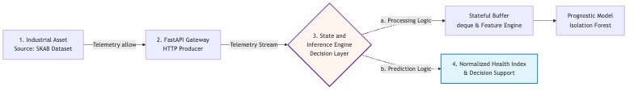

# SKAB Digital Twin — Anomaly Detection Framework

A production-grade Digital Twin analytics module for industrial IoT sensor streams, built on the Skoltech Anomaly Benchmark (SKAB) water treatment plant dataset.

## Architecture
```text
skab-digital-twin/
├── config.py              # Central configuration
├── run_pipeline.py        # Live streaming simulation entry point
├── evaluate.py            # Full evaluation + plot generation
├── twin/
│   ├── ingestion.py       # Data loading + stream generator
│   ├── features.py        # Rolling window feature engineering
│   ├── models.py          # Isolation Forest + SPC engines
│   ├── ensemble.py        # Voting fusion + temporal debouncing
│   └── visualizer.py      # All plot generation
├── notebooks/
│   └── exploration.ipynb  # Interactive data exploration
└── results/               # Auto-generated plots + report
```

## Pipeline Architecture


## How it works

### Two-Engine Ensemble
* **Engine 1 — Isolation Forest**: Detects geometric outliers in multivariate sensor space using rolling window features (raw + mean + std + diff).
* **Engine 2 — Statistical Process Control**: Monitors each sensor independently against a calibrated 2σ baseline.

### Voting Fusion Layer
Both engines vote on each incoming tick. A temporal debouncing buffer requires 3 consecutive dual-engine confirmations before escalating to a critical alert — preventing false shutdowns from transient noise.

### Alert States
| State | Meaning |
| :--- | :--- |
| 🟢 NOMINAL | Both engines agree: normal operation |
| 🟡 LOW-CONFIDENCE WARNING | One engine flagged an anomaly |
| 🔴 HIGH-CONFIDENCE ALERT | Both engines confirmed for 3+ consecutive ticks |

## Results
| Model | Precision | Recall | F1 |
| :--- | :--- | :--- | :--- |
| Baseline Isolation Forest | 0.71 | 0.99 | 0.83 |
| + Rolling Window Features | 0.72 | 0.97 | 0.83 |

*Rolling Window achieves 0.97 Recall — catches 97% of all anomalies. Threshold selected on a held-out validation set (no test leakage). In safety-critical industrial environments, missing a fault is far costlier than a false alarm.*

## Quickstart
```bash
git clone https://github.com/yasirjumani/skab-digital-twin.git
cd skab-digital-twin
python3 -m venv venv && source venv/bin/activate
pip install -r requirements.txt
python3 evaluate.py        # Full evaluation + saves plots to results/
python3 run_pipeline.py    # Simulates live sensor stream with alerts
```

## Dataset
SKAB contains real sensor recordings from a water treatment plant with labeled anomalies across 8 channels: accelerometers, current, pressure, temperature, thermocouple, voltage, and flow rate.

## Background
This project extends the Digital Twin methodology from my M.Sc. thesis — *"The Digital Twin of an IC Production Line Based on Lingua Franca and Machine Learning"* (University of Verona, 2025) — applying the same IIoT sensor fusion and predictive monitoring principles to a public benchmark.

## Author
**Yasir Ahmed** — M.Sc. Computer Engineering, University of Verona
[LinkedIn](https://www.linkedin.com) • [GitHub](https://github.com/yasirjumani)
